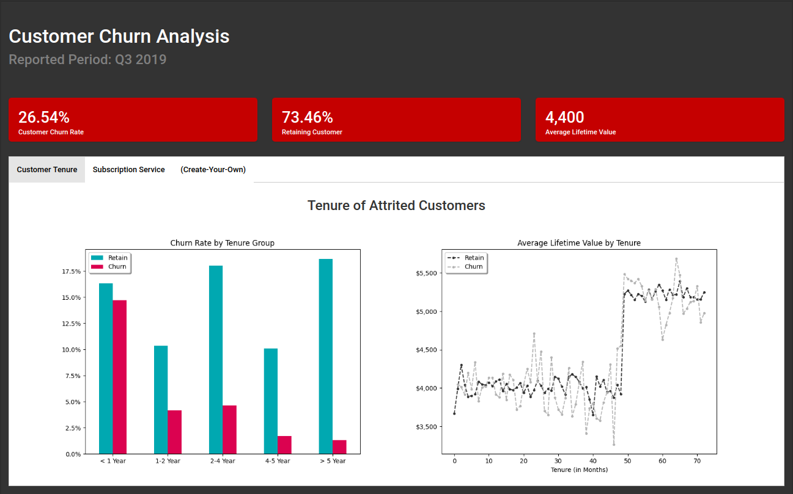

# Data Analysis Capstone:<br> Telco Customer Churn Analysis Dashboard

[](http://dachurn.herokuapp.com/)

This project is developed as one of [Algoritma Academy](https://algorit.ma/) Data Analytics Specialization using capstone Projects. The deliverables of this project is a simple analytic dashboard using Flask framework.

The skeleton for this application is separated into 2 different files: [app.py](app.py) and [helper.py](helper.py), in which the first one handles the routing and within [helper](helper.py) you would define function to be called in [app](app.py).

The [Customer_Churn_Analysis](Customer_Churn_Analysis.ipynb) notebook contains all the tasks and explanation which will guide you to complete the given skeleton.

## Rubrics

To get the full 16 points, you will need to complete the following tasks:
- Load and pre-process data (*2pts*)
- Extract quick summary (*3pts*)
- Generate the plot (*4pts*)
- Create your own analysis (*4pts*)
- Make the flask app run properly (*3pts*)

## Dependencies

If you browse on [assets](assets) directory on this repository, you'll find a file called [requirements.txt](assets/requirements.txt). The file contains dependencies for this project.

Run the following command to create a new conda environment from requirements.txt:

**Step 1**: Prepare a new "blank" environment then activate it

```
conda env create -n <ENV_NAME> python=<PYTHON_VERSION>
conda activate <ENV_NAME>
```

**Step 2**: Navigate to the folder with your `requirements.txt`

```
cd <PATH_TO_REQUIREMENTS>
```

**Step 3**: Install the requirements

```
pip install -r requirements.txt
```

Now you have successfuly installed all the requirements needed on this project! For your convenience, don't forget to link your new environment to jupyter-notebook by installing the kernel:

```
pip install ipykernel
python -m ipykernel install --user --name=<ENV_NAME>
```

## Dataset Details

The data set is taken from [IBM sample data sets](https://community.ibm.com/community/user/businessanalytics/blogs/steven-macko/2019/07/11/telco-customer-churn-1113) for telco customer retention programs. 

> "The Telco customer churn data contains information about a fictional telco company that provided home phone and Internet services to 7043 customers in California in Q3. It indicates which customers have left, stayed, or signed up for their service. Multiple important demographics are included for each customer."


The dataset includes information about:

- **Customers who left within the last month** – the column is called `churn_label`
- **Services that each customer has signed up for** – phone, multiple lines, internet.
- **Customer account information** – contract, monthly charges, and total charges
- **Demographic info about customers** – gender, city, age range, and if they have partners and dependents

### Data Glossary

- `customer_id`: A unique ID that identifies each customer.  
- `city`: The city of the customer’s primary residence.  
- `gender`: The customer’s gender: `Male`, `Female`  
- `senior_citizen`: Indicates if the customer is 65 or older: `Yes`, `No`  
- `dependents`: Indicates if the customer lives with any dependents: `Yes`, `No`. Dependents could be children, parents, grandparents, etc.  
- `tenure_months`: Indicates the total amount of months that the customer has been with the company by the end of the quarter specified above.  
- `phone_service`: Indicates if the customer subscribes to home phone service with the company: `Yes`, `No`  
- `multiple_lines`: Indicates if the customer subscribes to multiple telephone lines with the company: `Yes`, `No`  
- `internet_service`: Indicates if the customer subscribes to Internet service with the company: `No`, `DSL`, `Fiber Optic`, `Cable`.  
- `contract`: Indicates the customer’s current contract type: `Month-to-Month`, `One Year`, `Two Year`.  
- `monthly_charges`: Indicates the customer’s current total monthly charge for all their services from the company.  
- `total_charges`:  Indicates the customer’s total charges, calculated to the end of the quarter specified above.  
- `churn_label`: `Yes` = the customer left the company this quarter. `No` = the customer remained with the company.    
- `cltv`:  A calculation that assigns a CLTV value to one of the following categories: 2000-2500, 2501-3000, 3001-3500, 3501-4000, 4001-4500, 4501-5000, 5001-5500, 5501-6000, 6001-6500, and 6501-7000.


